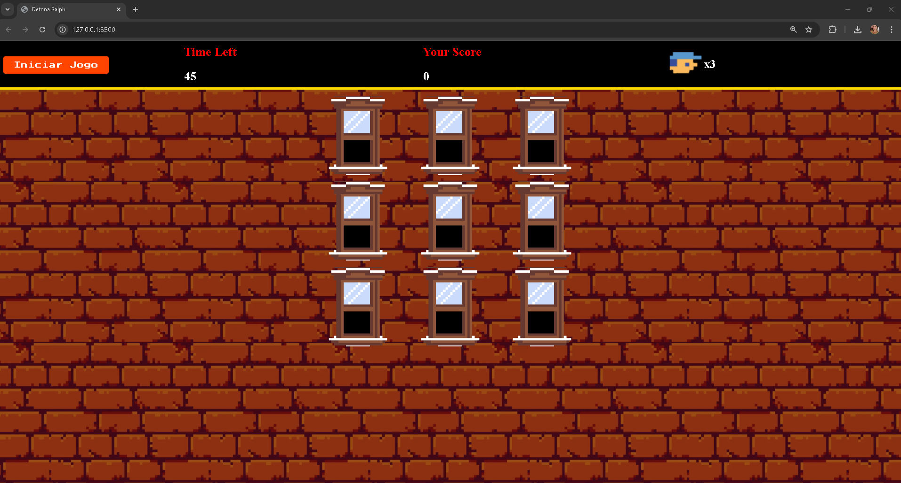

# 👾 Detona Ralph com JavaScript

Este simples jogo do **Detona Ralph** foi produzido durante o **Desafio de Projeto da DIO**, usando as ferramentas mais utilizadas da web: **HTML**, **CSS** e **JavaScript**. Durante o projeto, foram trabalhados os conceitos de variáveis **View** e **Values**, além das **Actions** para executar determinadas funções.

## 🧰 Ferramentas utilizadas
- **HTML**: Para o corpo da página.
- **CSS**: Para estilização do cenário e da área de gameplay.
- **JavaScript**: Para programar todo o comportamento do jogo.
- **Visual Studio Code**: Para o desenvolvimento do projeto.

## 💡 Habilidades desenvolvidas
- Organização das pastas e arquivos do projeto.
- Exploração dos conceitos de variáveis de **View**, **Values** e **Actions** para melhor organização dos sistemas do jogo.
- Manipulação dinâmica de classes CSS para movimentação do inimigo.
- Detecção de cliques com listener para receber pontos sempre que acertar o inimigo.

## 🕹 Como jogar
1. Baixe ou clone o repositório:
   ```bash
   (https://github.com/rafaabenza/detonaralph-bootcamp.git)
2. Procure pelo arquivo index.html na raiz do projeto.
3. Execute o arquivo em seu navegador e comece a jogar.

## ⏳ Atualizações futuras
- [ ]  Deixar o jogo responsivo para mobile.
- [ ]  Corrigir pequenos bugs no placar e no timer.

## ✅ Atualizações realizadas 
- Implemento do sistema de vidas (Onde se errar a janela, perde uma vida)

# O Projeto

[](./src/video/Detona%20Ralph%20-%20Jogo.mp4)

Clique no link abaixo para assistir ao vídeo do jogo:

[Assista ao vídeo](./src/video/Detona%20Ralph%20-%20Jogo.mp4)


  
